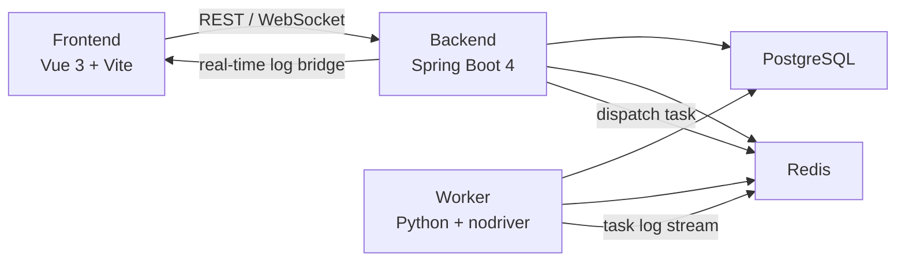

<div align="center">

# OmniGate

<p>账号资产管理与自动化任务执行平台</p>

<p>
  
  
  
  
  
  
  
  
</p>

<p>
  
  
  
  
</p>

</div>

OmniGate 是一个面向账号资产管理与自动化任务执行的全栈项目，当前仓库包含：

- Vue 3 + Vite 管理前端
- Spring Boot 4 模块化单体后端
- Python Worker 浏览器自动化执行节点
- PostgreSQL + Redis 基础设施

项目的核心目标是把“账号管理”、“任务编排”、“浏览器自动化执行”和“实时日志回显”串成一条完整链路。当前仓库中，Google 账号模块的任务执行链路最完整，其它平台模块采用相同的扩展方式接入。

## Overview

OmniGate 主要解决两类问题：

- 用统一后台管理多平台账号资产
- 把高耗时、可重试、可观测的浏览器自动化任务从主业务进程中解耦出来

当前仓库已经具备一条完整的任务链路：

- 前端触发任务
- 后端入队并记录任务状态
- Worker 消费任务并执行浏览器自动化
- Redis Stream 承载任务与日志流
- WebSocket 把实时日志回推前端
- PostgreSQL 作为任务状态和业务数据的最终落库

如果你想快速判断这个项目适不适合你，最核心的几个关键词就是：

- 账号资产池
- 后台任务编排
- 浏览器自动化执行
- 实时日志可视化
- Docker 单机部署

## Features

- 模块化单体后端，便于按业务边界扩展和拆分
- JWT 双 Token 鉴权
- Redis Stream 任务队列与日志流
- Python Worker 执行浏览器自动化任务
- PostgreSQL 持久化任务状态与账号数据
- WebSocket 实时日志推送
- Docker 五容器部署方案
- Google 账号详情页任务联动、状态回写和实时日志面板

## Highlights

### Unified Admin Surface

一个后台统一承载账号管理、任务触发、执行状态、任务日志和结果回写，不需要把任务系统拆成额外的独立控制台。

### Async Task Runtime

浏览器自动化执行放在 Python Worker 中，通过 Redis Stream 做投递、消费、日志桥接和重试，避免长任务阻塞主后端。

### Real-Time Visibility

任务不是“点一下等结果”的黑盒，前端详情页可以看到运行状态、关键轨迹和实时日志，适合人工排查和运营场景。

### Deployable by Default

仓库已经内置五容器 Docker Compose 方案，并补了 Linux 部署脚本，适合在单机云服务器或内网环境快速拉起。

## Architecture



任务执行主链路：

1. 管理员在前端触发任务
2. 后端创建 `task_runs` 记录并写入 Redis Stream
3. Worker 消费任务并执行浏览器自动化流程
4. Worker 将执行状态和业务结果回写 PostgreSQL
5. Worker 将日志写入 Redis Stream
6. 后端通过 WebSocket 把任务日志实时推送给前端

## Supported Modules

当前仓库中的业务模块包括：

- `omnigate-user`: 管理员登录、鉴权、权限基础设施
- `omnigate-google`: Google 账号资产与任务链路
- `omnigate-chatgpt`: ChatGPT 账号模块骨架
- `omnigate-github`: GitHub 账号模块骨架

其中 Google 模块目前是最完整、最适合作为扩展参考的实现。

## Tech Stack

### Frontend

- Vue 3
- Vite 7
- Element Plus
- Pinia
- Axios

### Backend

- Spring Boot 4.0.3
- Spring Security
- MyBatis-Plus 3.5.15
- Flyway
- PostgreSQL
- Redis
- Java 25

### Worker

- Python 3.11
- nodriver
- asyncpg
- SQLAlchemy asyncio
- Redis asyncio client

## Repository Layout

```text
.
├── omnigate_frontend/         # Vue 管理前端
├── omnigate_backend/          # Spring Boot 后端父工程
│   ├── omnigate-common/       # 公共基础设施
│   ├── omnigate-user/         # 用户与鉴权模块
│   ├── omnigate-google/       # Google 账号模块
│   ├── omnigate-chatgpt/      # ChatGPT 账号模块
│   ├── omnigate-github/       # GitHub 账号模块
│   └── omnigate-bootstrap/    # 启动与组装模块
├── omnigate_worker/           # Python Worker
├── scripts/                   # 部署与更新脚本
├── docker-compose.yml         # 五容器部署编排
├── .env.example               # Docker 环境变量示例
└── DEPLOY_ALMALINUX_DOCKER.md # AlmaLinux / Docker 部署说明
```

## Quick Start

### Option A: Docker Compose

这是最直接的启动方式，适合联调和服务器部署。

```bash
cp .env.example .env
```

修改 `.env` 里的关键值：

```env
POSTGRES_PASSWORD=your-strong-password
OMNIGATE_JWT_SECRET=your-random-secret-with-32-chars-at-least
FRONTEND_PORT=80
```

如果你希望由宿主机 Nginx 接管 80 端口，再反向代理到 Docker 内的前端容器，额外设置：

```env
FRONTEND_BIND_HOST=127.0.0.1
FRONTEND_PORT=8088
HOST_NGINX_ENABLE=true
HOST_NGINX_SERVER_NAME=your-domain-or-server-ip
```

启动：

```bash
docker compose build
docker compose up -d
docker compose ps
```

也可以直接使用仓库内脚本：

```bash
bash scripts/deploy-linux.sh
```

更新已部署代码：

```bash
bash scripts/update_deployed.sh
```

更详细的 Linux 服务器部署说明见 [DEPLOY_ALMALINUX_DOCKER.md](./DEPLOY_ALMALINUX_DOCKER.md)。

### Option B: Local Development

适合本地开发和断点调试。

#### 1. 准备基础设施

- PostgreSQL
- Redis

后端默认开发环境配置见 [application-dev.yaml](./omnigate_backend/omnigate-bootstrap/src/main/resources/application-dev.yaml)。

默认开发库：

- PostgreSQL: `127.0.0.1:5432/omnigate_dev`
- Redis: `127.0.0.1:6379/0`

#### 2. 启动后端

```bash
cd omnigate_backend
./mvnw -pl omnigate-bootstrap -am spring-boot:run -Dspring-boot.run.profiles=dev
```

Windows:

```powershell
cd omnigate_backend
.\mvnw.cmd -pl omnigate-bootstrap -am spring-boot:run -Dspring-boot.run.profiles=dev
```

#### 3. 启动 Worker

```bash
cd omnigate_worker
python -m venv .venv
source .venv/bin/activate
pip install -r requirements.txt
python -m src.main
```

#### 4. 启动前端

```bash
cd omnigate_frontend
npm install
npm run dev
```

#### 5. 默认管理员

Flyway 初始化后会创建默认管理员：

- username: `admin`
- password: `ChangeMe123!`

来源见 [V1.0.1__init_default_user.sql](./omnigate_backend/omnigate-bootstrap/src/main/resources/db/migration/V1.0.1__init_default_user.sql)。

首次登录后应立即修改默认密码。

## Development Notes

### Frontend

```bash
cd omnigate_frontend
npm run dev
npm run build
```

### Backend

```bash
cd omnigate_backend
./mvnw -q -DskipTests compile
```

### Worker

```bash
cd omnigate_worker
python -m src.main
```

## Deployment

生产部署采用五容器方案：

- `frontend`
- `backend`
- `worker`
- `postgres`
- `redis`

关键适配点：

- 前端容器使用 Nginx 托管静态资源，并代理 `/api` 与 `/ws/task-log`
- 后端容器默认运行 `prod` profile
- Worker 容器内置 Chromium 运行环境
- Worker 启动顺序已和后端健康检查、数据库迁移顺序对齐

部署文档见 [DEPLOY_ALMALINUX_DOCKER.md](./DEPLOY_ALMALINUX_DOCKER.md)。

## Roadmap

- 完善 ChatGPT / GitHub 模块的前后端链路
- 补充更多自动化任务模板
- 增加系统级健康检查与监控指标
- 提供更标准的测试与 CI 流程
- 增加 HTTPS / 反向代理生产模板

## Contributing

欢迎提 Issue 或 Pull Request。提交前建议至少完成：

- 前端构建通过：`npm run build`
- 后端编译通过：`./mvnw -q -DskipTests compile`
- Docker Compose 配置可解析：`docker compose config`

如果改动涉及任务链路，建议同时验证：

- 任务创建
- Worker 消费
- 数据库状态回写
- WebSocket 实时日志

## Documentation

- [DEPLOY_ALMALINUX_DOCKER.md](./DEPLOY_ALMALINUX_DOCKER.md)
- [python端设计.md](./python端设计.md)
- [后端设计文档.md](./omnigate_backend/后端设计文档.md)

## License

当前仓库尚未提供 `LICENSE` 文件。  
如果你打算以开源项目形式对外发布，建议补充明确的开源许可证后再公开分发。
